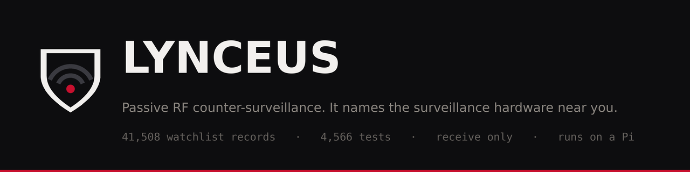

<div align="center">



# Lynceus Warden

**Something near you is broadcasting. Lynceus tells you what.**

[](https://github.com/kevwillow/lynceus-warden/actions/workflows/ci.yml?query=branch%3Amain)
[](https://github.com/kevwillow/lynceus-warden/actions/workflows/codeql.yml?query=branch%3Amain)
[](LICENSE)
[](https://www.python.org/)
[](#project-status)

[](#what-lynceus-does)
[](#privacy--threat-model)
[](#privacy--threat-model)
[](#installation)

</div>

> [!WARNING]
> **Active development. Expect issues.** This is personal-use software, not a
> hardened product. Run it on hardware you control, in a jurisdiction where
> passive RF observation is legal, and read the source before you trust it
> with anything that matters.

---

## What is Lynceus

A passive RF watchtower for the airspace you live in. It listens to the Wi-Fi
and Bluetooth traffic already flying past your antenna, matches every device it
hears against a curated database of surveillance hardware, and pushes an alert
to your phone when something interesting turns up. License-plate readers,
drones, gunshot-detection nodes, body cams, trackers.

It never transmits. It never probes. It never associates. It listens, and it
tells you the truth about what it heard.

```
      ((( o )))          ((( o )))          ((( o )))
          |                  |                  |
         alpr              drone             tracker
          +------------------+------------------+
                             |
                             v
                   +--------------------+
                   |  lynceus  listens  |   never transmits
                   +---------+----------+
                             |
                             v
                     your phone buzzes
```

Tools to surveil people are cheap and everywhere. Tools to notice being
surveilled are neither. Lynceus is one of the second kind.

---

## What it looks like

The dashboard, running against the repo's own synthetic fixtures plus the
bundled Argus snapshot. Every MAC below is a test value, not a real capture.
Some shots are the dark theme and some the light one: both ship, both are
what the product renders from your OS setting, and neither is a mock-up.


Triage on `/alerts`. Acknowledge, snooze, or start watching a MAC without
leaving the row:


The bundled watchlist, filtered to license-plate readers. Every row carries
its Argus record id, vendor, and confidence score, and links through to the
public source it came from:


Probe history on `/probes`, exactly as the page opens: three devices, and the
networks each one asked for kept behind a `reveal` control rather than printed
on screen. Click through and you can find two devices with nothing else in
common asking for the same unusual network. That is the kind of correlation a
randomised MAC address will never give you:


That page is off by default, and the device-to-network pairing stays collapsed
until you ask for it. Opening the page never puts it on screen.

And the part most tools skip. `/settings` says when a feature is switched on
but cannot possibly work, instead of leaving you to guess at antennas:


## What Lynceus does

A small daemon plus a read-only web UI. The daemon polls a local
[Kismet](https://www.kismetwireless.net/) instance for everything it has
heard, persists sightings to SQLite, and runs each one through a rules engine
backed by a watchlist of RF signatures. Matches become alerts, both in the UI
and as push notifications via [ntfy](https://ntfy.sh/).

The threat model is narrow and deliberate: **detect surveillance-relevant
hardware in the operator's own environment.** Lynceus is not a network attack
tool, not a tracking tool, and not a substitute for paying attention.

### What it's looking for

The bundled watchlist is a snapshot of [Argus](https://github.com/kevwillow/argus-db),
the companion RF-signature database. **23,441 identifiers** land in your
database from a 41,508-record export. Nearly all of the difference is
intelligence Argus carries that cannot be recovered from passive RF at all:
hostnames, firmware strings, certificate hashes, FCC codes. The import report
names each dropped type and its count, rather than filing 43% of your download
under "unknown" and leaving you to wonder what broke.

Of what lands, most rows are vendor-level identifiers without a confirmed
device category. The categorised set is smaller and sharper:

| Category | Rows | Representative hardware |
| --- | ---: | --- |
| `drone` | 473 | DJI and friends, plus Remote-ID broadcast prefixes |
| `cctv_camera` | 143 | Hikvision-class fixed cameras |
| `alpr` | 62 | Flock Safety and other plate readers |
| `gunshot_detect` | 41 | SoundThinking / ShotSpotter-class nodes |
| `police_radio` | 13 | |
| `hacking_tool` | 13 | Known-bad pentest hardware |
| `persistent_surveillance` | 12 | |
| `drone_detect` | 8 | Counter-UAS equipment |
| `body_cam` | 7 | |
| `gps_tracker` | 1 | |
| `unknown` | 22,774 | Vendor-attributed identifiers, category not yet assigned |

Every one of those rows traces back to a verifiable public source through
Argus's audit trail. That is the whole point of the project. See
[How this got built](#how-this-got-built).

### Non-negotiables

These are design commitments, not current limitations:

- **Passive only.** Lynceus never transmits, probes, injects, or associates.
  It reads what Kismet already heard. That applies to Argus too: detection
  only, no jamming, no spoofing, no interference.
- **The read-only UI is a security boundary.** The web UI never mutates your
  configuration: `lynceus.yaml`, rules and capture settings change only
  out-of-band, via `lynceus-setup` or the YAML. It does record operator
  decisions: acks, notes, snoozes, watchful entries, and the daemon-managed
  `allowlist_ui.yaml`. Triage is what the UI is for. What it cannot do
  is change what Lynceus captures or how it is deployed. Read-only about
  configuration is a feature, not a missing one.
- **No telemetry.** Lynceus does not phone home. At runtime it connects to the
  Kismet instance you point it at (`kismet_url`, `http://127.0.0.1:2501` by
  default, but any host you configure), to the ntfy broker you configured, and
  to GitHub when you explicitly run a watchlist refresh. That is the whole
  list. (Installation itself resolves Python
  dependencies from PyPI through `pip`, like any Python project. The
  installer fetches no Lynceus or Argus artifacts, and ships no `curl | bash`
  path.)
- **Probe SSID capture is OFF by default.** A device's probe list is a partial
  history of the networks it has joined. Capturing that by default would aim
  Lynceus at bystanders instead of at surveillance gear. You opt in explicitly,
  and `/settings` says loudly which mode you're in.

## How it works

```
+----------------+   poll    +----------+   write   +-----------+
|   Kismet API   |<----------|  poller  |---------->|  SQLite   |
+----------------+           +----+-----+           +-----+-----+
                                  |                       ^
                                  | rules engine          | read
                                  v                       |
                              +---+----+              +---+-----+
                              |  ntfy  |<-- alerts    |  webui  |
                              +--------+    rendered  | (FastAPI|
                                                      |  Jinja2)|
                                                      +---------+
```

- **Poller** (`lynceus`) polls the Kismet REST API on an interval, runs the
  rules engine over each sighting, and persists sightings and alerts.
- **Rules engine.** Watchlist matching across MAC, OUI, MAC range, BLE
  service UUID, BLE manufacturer id, BLE local name, exact and substring SSID,
  and drone Remote-ID prefix. Plus allowlist suppression, first-sighting
  heuristics, watchful recurrence tracking, and per-alert / per-rule-type
  snooze gates.
- **Database.** SQLite with 23 versioned migrations and XDG-aware path
  resolution. Every migration ships a paired `_down.sql`, and
  `lynceus-validate rollback --target-version N` walks the chain in reverse
  with interactive confirmation. One migration (010, pattern normalisation) is
  irreversible by design and is skipped with a logged warning. **Back up the
  database before rolling anything back.**
- **Web UI** (`lynceus-ui`). FastAPI + Jinja2, read-only, served by uvicorn.
- **Notifier.** ntfy push, severity-mapped priority and tags.

## Features

- **Operator triage that survives contact with real alert volume.** `/alerts`
  filters on severity, time window (relative buckets or an absolute range down
  to the minute), ack state, search, rule type, and whether an alert already
  has a note or an action against it. Per-alert snooze with pickable durations
  (`1h / 24h / 7d / 30d / forever`), per-rule-type snooze on `/rules`
  alongside a fires-breakdown, single and bulk acknowledge, keyboard
  shortcuts, and a streaming CSV export that mirrors whatever filter you have
  applied.
- **Watchful snooze, for the device that shouldn't page you *yet*.** Some
  MACs shouldn't alert on every sighting but absolutely should escalate if
  they keep turning up. `/watchful` tracks them, groups escalations into a
  weekly recurrence digest, and fires a priority-4 alert on the 4th sighting
  (with a ≥24h gap debounce). Per-entry actions: dismiss, promote to
  allowlist, reset, flag for investigation, or close as confirmed-safe.
  Unactioned entries auto-archive after 90 days.
- **Watchlist exploration with full provenance.** Search and filter the whole
  corpus at `/watchlist`; every row links to the Argus record behind it:
  vendor, source URL, source excerpt, FCC ID, geographic scope, first-seen and
  last-verified. Cross-links to the alerts it matched. CSV export included.
- **Probe-SSID history** *(off by default)*. Phones and laptops shout the
  names of networks they have joined before, looking for them again. `/probes`
  collects that per device, and inverts it: which networks did this device
  ask for, and which devices asked for this network.

  This is the surface that answers a question a MAC address cannot. Modern
  phones randomise their MAC, so the same device looks like a new one every
  time it appears. Its probe list does not randomise. A device you have never
  seen before, asking for a network you recognise, is a much stronger signal
  than an address, and two unrelated devices asking for the same unusual
  network are probably connected to each other. If you are trying to work out
  whether someone you know is turning up where you are, that correlation is
  the thing that tells you.

  It is off by default and stays off until you say otherwise, because a probe
  list is a partial history of where a person has been and switching this on
  captures it from everyone in range, not just from whoever you are worried
  about. `/settings` shows a recording warning whenever it is on. `/probes`
  keeps the device-to-network *pairing* behind a click in both of its
  groupings, so opening the page never puts that pairing on screen. Grouped by
  device (the default) it shows only how many networks each device probed for
  ("reveal 2 network(s)") with the names inside the closed reveal. Grouped by
  network it names the networks but keeps the devices that probed for each one
  inside the reveal, because there the identifying concentration is *which*
  devices wanted that network.
- **Passive BLE bridge + Apple Continuity decoder** *(off by default)*.
  Kismet's classic Bluetooth path surfaces no advertisement payload, which
  left the BLE matchers with nothing to chew on. A passive `bleak` scan on its
  own adapter feeds them, and a decoder sorts Apple adverts into
  `find_my_separated`, `find_my`, `find_my_paired`, `airpods`, `nearby`, or
  `apple_unknown`. Payload bytes are read inside the scan callback and dropped
  there. Only the label survives, and a regression test fails the build if
  anyone starts buffering the raw bytes. Read
  [the enablement notes](docs/CONFIGURATION.md#ble_bridge--passive-ble-capture-bridge)
  before switching it on: it needs an adapter Kismet isn't holding, and it
  needs the optional scan library, which a default install does not ship
  (`pip install 'lynceus[ble]'`). The setup wizard and `/settings` both check
  every known way an enabled bridge silently does nothing: adapter contention,
  a source filter that drops its own observations, a missing scan library, a
  BlueZ without passive-scan support, a rule so broad it alerts on every Apple
  device, and no enabled rule consuming what it decodes. Both print the fix.
- **Ergonomic CLI tooling.** A wizard (`lynceus-setup`, with a browser-based
  `--web` flow for headless boxes), a Kismet bootstrapper, a config validator
  with migration rollback, a config exporter for backup and diffing, and
  `lynceus-quickstart` to bring the whole thing up in the foreground for a
  demo.
- **Deployment that expects to be left alone.** Hardened systemd units
  (`NoNewPrivileges`, `ProtectSystem=strict`, restricted namespaces), an
  installer that fetches no code or data of its own, an opt-in weekly
  watchlist refresh timer, and a read-only `/settings` page that tells you
  what's actually running: capture state, Kismet and ntfy reachability, BLE
  bridge status and what it has decoded, watchlist origin and freshness.
  Secrets redacted server-side.
- **Dark mode that doesn't flash.** Persistent per-operator preference in
  `localStorage`, resolved by a bootstrap script in the `<head>` before first
  paint, so moving between pages never strobes the wrong palette at you.
  Toggle lives in the topnav.

### What it will never do

It will not name the tracker following you.

A Find My device rotates both its BLE address and its identity key every few
minutes, deliberately, to defeat exactly this kind of passive observation. An
AirTag and an AirPods case emit the same shape of advert. Apple's own stalking
alerts work because your iPhone holds owner keys and can ask Apple's servers;
no third-party listener can reproduce that on any adapter, ever.

What Lynceus can honestly tell you is that **an unfamiliar separated Find My
emitter is in range, correlated within one rotation window.** That's the
ceiling. Treat any product promising more than that with suspicion.

There is a second half to that ceiling, and it is the half worth knowing before
you quote the rest of this page back at anyone. Lynceus's real advantage over a
proximity keychain is that it keeps a **record**: a `location_id` per sighting,
co-observation across places, a device you can look up three weeks later. That
record is keyed on MAC address. A device that rotates its address is a new row
every time.

Driven through the ingest and database path, **not** over the air, one tracker
at three locations over three weeks, rotating as a real one does, produces
**three unrelated device rows, one sighting each, and zero co-observation
candidates.**

So the record is real, and it is real for the things this was built to watch:
ALPR cameras, body cams, gunshot-detection nodes, fixed readers. Surveillance
infrastructure broadcasts from a stable address, because it is not trying to
hide. It is **not** a per-tracker history. Lynceus alerts you **per encounter**;
it will not tell you that the tracker in your bag today is the one that was in it
last Tuesday. If that ever changes it will be a feature with a version number,
not an implication left lying around on this page.

The same honesty applies elsewhere: the BLE service-UUID and manufacturer-id
matchers are built and tested, but they are **inert unless you enable the BLE
bridge**, because Kismet's classic capture path never hands them any payload.
And an enabled bridge is inert too until `bleak` is installed. It is an
optional extra, so a default install starts the bridge, logs one warning, and
captures nothing. That is indistinguishable from a working bridge that has
heard nothing, which is why `/settings` now says so outright instead of
leaving you to guess at antennas.
The drone Remote-ID matcher is likewise correct but unproven in the field:
no drone has been captured yet to confirm which Kismet field carries the
serial. Both are tracked openly in [BACKLOG.md](BACKLOG.md).

## Project status

**v1.2.0**. The web UI can require a password. One operator, one password:
scrypt hash, server-side sessions, a login form, and a lockout after five wrong
attempts. Set it with `lynceus-ui-passwd`, and the hash lands in the state
directory at `0600`, never in `lynceus.yaml`.

On loopback it stays off unless you turn it on. There the bind is the control,
and forcing a password at upgrade time would lock existing operators out of
their own dashboard. Bind anywhere else and `lynceus-ui` refuses to start
without one, printing the command that fixes it. The previous behaviour was a
banner and a server that started anyway, which is how a security feature ships
switched off in the exact place it was needed.

⚠️ **A password is not TLS, and Lynceus serves none.** Over a non-loopback bind
the password and its session cookie cross the network in the clear. Use an SSH
tunnel or a private network. The startup banner now says so.

This release also bounds what the anti-forgery check will buffer. That check
reads the request body before it authenticates anyone, so a caller who could
reach the port could make the process allocate without limit. On a Raspberry Pi
that is the whole machine.

v1.1.1 added the case file, the record this product keeps, exported as a bundle
you can hand to a journalist, a lawyer or a researcher. It also added
`lynceus-quickstart --demo`, which evaluates Lynceus in about four seconds with
no Kismet, no adapter and no Pi.

v1.0.0 was the first release under AGPL-3.0, closing the 0.9.x line with Find My
tracker alerting shipped **enabled** rather than commented out.

⭐ **The tracker alert has fired on a real tracker, off the air.** Measured
2026-08-20: a genuine `find_my_separated` advertisement, a tracker away from
its owner, reached the production scanner, decoded, persisted, matched
the shipped `apple_find_my` rule, and produced an alert row with a notification
dispatched. Nothing in that run was synthetic: the shipped `config/rules.yaml`,
the real bridge, a real adapter, a real tracker.

**Why that result stands on its own:** receiving an advertisement and raising an
alert from it is self-validating. The scanner was live at that
moment, or there would have been nothing to decode. ⚠️ An earlier draft of this
paragraph also claimed the adapter was "asserted powered before and after";
that check named a *different* controller than the one scanning, so it
contributed nothing, and a before/after check would not have proved continuous
operation anyway. The claim is withdrawn; the measurement does not need it.

```
ff:1f:9e:91:52:bc   class='find_my_separated'
alert: apple_find_my / ble_device_class / severity med
       "BLE device class find_my_separated matched:
        Apple Find My tracker away from its owner"
```

That was the last unproven hop. The pieces were already validated on hardware:
the capture bridge end to end from inside the daemon, and the decoder against
**204 real Find My frames from 5 devices**. The *joint* event could not happen
until this release enabled the rule.

⚠️ **Three things that run still did not prove, stated because a partial proof
quoted as a whole one is how this page would stop being trustworthy:**

- **Push delivery.** The notifier was called with the right payload; a real
  ntfy push was not sent. The last hop to your phone is untested.
- **The daemon's own scheduling.** The flush was driven directly. That logic is
  production, but the long-running restart-and-retry loop was not exercised.
- **Identity across rotations**, described further up. One
  tracker, one advert; no rotation occurred in the window.

A default install also ships without `bleak`, so the bridge captures nothing
until you `pip install 'lynceus[ble]'`, and `/settings` will tell you so.

**The test suite ships, so you can check the claims on this page yourself.**
CI runs `pytest -q`, `ruff check .` and `python -m build` on Python 3.11 and
3.12 for every push and pull request, in about nine minutes, and on **arm64**
as well as x86-64, because the machine this is built for is a Raspberry Pi. Most recently
measured: **4447 passed, 1 skipped, 47 deselected**, at commit
[`7958b28`](https://github.com/kevwillow/lynceus-warden/actions/runs/32403708354)
with the same total on all three legs, x86-64 Python 3.11 and 3.12 and arm64.
That is the version-bump commit itself, not its parent and not a branch head.

The commit is named on purpose. A bare total is a claim that quietly stops
being true at the next merge. This one had drifted to 3294 against an actual
3494 before it was caught, on the very paragraph inviting you to verify it. A
number you cannot date is a number you cannot check. Expect the current total
to be *higher* than the figure above: compare against the newest run on `main`,
and treat a *lower* one as worth asking about.

⚠️ Expect the *skip* to differ from ours, and check which test it is rather
than the count. One test skips when `/sys/class/bluetooth` exists (it needs the
directory absent) and another skips without a live Argus CSV, so a machine
with Bluetooth and no CSV reports two skips, and CI reports one. `.claude/gates.md`
records the traps that make a green run mean less than it looks like.

Ten test files, plus one capture fixture, stay out of the repo because they
embed the capture adapter's own MAC or the rig account name, which is what
"the fixtures describe a real rig" actually meant. They are listed by name in
`.gitignore` rather than hidden behind a glob. Everything else is tracked, so
the number above is the number you get: there is no larger private suite
behind it. [CONTRIBUTING.md](CONTRIBUTING.md) and `.claude/gates.md` record
the traps that make a green run mean less than it looks like. In particular,
check *which* test skipped rather than the skip count.

## Try it without hardware

Lynceus normally needs Kismet and a monitor-mode adapter. To see what it does
before setting any of that up:

```sh
git clone https://github.com/kevwillow/lynceus-warden
cd lynceus-warden && ./install.sh --user
lynceus-quickstart --demo
```

That replays a bundled recording into a throwaway database and opens the UI. It
touches no config of yours and captures no radio traffic. Ctrl+C ends it.

## Installation

**Linux is the supported target.**

```sh
git clone https://github.com/kevwillow/lynceus-warden
cd lynceus-warden
./install.sh --user
```

For a dedicated host, install system-wide:

```sh
sudo ./install.sh --system
```

> **Do NOT pipe `install.sh` through `curl | bash`.** Lynceus is a security
> tool. An install method that doesn't let you read the script first directly
> contradicts the project's threat model. If you want a one-liner, write your
> own. None is shipped.

Lynceus uses a dedicated venv to comply with PEP 668 (the
externally-managed-environment policy on Debian/Ubuntu/Kali), and exposes the
`lynceus-*` commands via symlinks, so you never activate anything by hand.
`--user` installs to `~/.local/share/lynceus/.venv` with symlinks in
`~/.local/bin/`; `--system` uses `/opt/lynceus/.venv` and `/usr/local/bin/`,
creates a `lynceus` system user, lays down `/etc/lynceus`, `/var/lib/lynceus`
and `/var/log/lynceus`, and installs the systemd units (without enabling
them, which stays your call). `install.sh` never passes `--break-system-packages`;
the venv is the whole point.

Run `./install.sh --help` for the full flag list. `--dry-run` works without
root and prints the planned commands. To reverse an install, pass the matching
scope to `--uninstall`, or use the `./uninstall.sh` wrapper which auto-detects
it. Add `--purge` to also delete config, database, and logs.

**macOS / Windows.** `pip install -e .` from a clone. The Python tools all
work; there is no service automation. Treat both as **development only**.
Production deployment is not supported.

### Troubleshooting

- **`install.sh` fails on `python3 -m venv`.** Install the venv module:
  `sudo apt install python3-venv` (Debian/Ubuntu/Kali),
  `sudo dnf install python3-virtualenv` (Fedora/RHEL). Arch ships it.
- **`lynceus-*` not found after install.** Confirm the install's bin directory
  is on your `PATH`: `~/.local/bin` for `--user` (the installer prints a hint
  when it isn't), `/usr/local/bin` for `--system`.

## Quick start

Full step-by-step for a fresh Kali / Debian / Ubuntu host is in
[docs/DEPLOYMENT.md](docs/DEPLOYMENT.md), including a "common issues" section
for the failure modes that actually show up. The short version:

1. **Install Lynceus.** Pick the scope now, because step 4 differs:
   `./install.sh --user` for a foreground demo on a machine you already use, or
   `sudo ./install.sh --system` for a dedicated always-on host. **`--user`
   installs no systemd units**. It is deliberately not a service install.
2. **Install and configure Kismet.** `sudo lynceus-bootstrap-kismet` detects
   monitor-capable Wi-Fi and Bluetooth interfaces, patches
   `/etc/kismet/kismet_site.conf` (append-only, so your edits survive), and adds
   you to the `kismet` group. On Debian/Ubuntu/Kali add `--install` to also
   add the official apt repo and install Kismet first. Idempotent; safe to
   re-run. Then log out and back in, start Kismet, open
   <http://localhost:2501>, set an admin password, and create a `readonly` API
   key named `lynceus`.
3. **Configure Lynceus.** `lynceus-setup`, or `lynceus-setup --web` for a
   browser wizard, which is friendlier for anyone who'd rather not hand-edit
   YAML. Either flow probes Kismet and ntfy, auto-locates the API key from
   `~/.kismet/session.db` (no copy-paste in the common case), and asks about
   probe-SSID capture with the privacy explanation attached. Press Enter at the
   ntfy prompt to skip notifications.

   ⚠️ **Say yes to Argus-backed alerting when it asks.** It is opt-in and
   defaults to *no*, and declining it writes no `rules.yaml`, which leaves you
   with a system that captures devices, populates the UI, and **can never raise
   an alert**. The `/rules` tile on the dashboard says `no ruleset, nothing
   will alert` when you are in that state.

   ⚠️ **`--web` on a headless box needs an SSH tunnel.** The wizard binds
   `127.0.0.1`, so `localhost:8766` in your laptop's browser is your *laptop*,
   not the Pi. Forward it first:
   `ssh -L 8766:127.0.0.1:8766 you@your-pi`, then open
   <http://localhost:8766>. The same applies to the dashboard on port 8765.
   Prefer this over `ui_allow_remote`. See [Privacy / threat model](#privacy--threat-model).
4. **Run.** After a `--user` install: `lynceus-quickstart` (daemon + UI +
   browser in the foreground, Ctrl+C to stop). After a `--system` install:
   `sudo systemctl enable --now lynceus.service lynceus-ui.service`.
   These are not interchangeable. A `--user` install has no units to enable.
5. **Verify.** Open the UI, watch sightings populate, browse `/watchlist`, and
   check `/settings` for capture state and connectivity.

## Configuration

`lynceus-setup` is the primary tool; re-run with `--reconfigure` to rewrite an
existing config (without that flag it refuses to clobber). Full field
reference in [docs/CONFIGURATION.md](docs/CONFIGURATION.md).

Config lives at XDG-aware paths: `~/.config/lynceus/lynceus.yaml` for
`--user`, `/etc/lynceus/lynceus.yaml` for `--system`. Operator-local severity
tuning lives alongside it in `severity_overrides.yaml`.

To inspect the running configuration without touching files, open `/settings`.
It's read-only by design; to change something, re-run the wizard.

## Bundled threat data

A point-in-time Argus snapshot ships inside the wheel at
`src/lynceus/data/default_watchlist.csv`. That is 41,508 records exported
2026-06-03, of which 23,441 are RF-matchable and land in your database.
Lynceus is **not** redistributing the full Argus corpus.

Refresh from the latest published export:

```sh
lynceus-import-argus --from-github
```

That pulls `exports/argus_export.csv` from the latest release of
[`kevwillow/argus-db`](https://github.com/kevwillow/argus-db) and preserves the
artifact at `<data-dir>/argus-cache/<ref>__argus_export.csv` so each refresh
leaves an audit trail. Pin a ref with `--ref v1.2.3`, point at a fork with
`--repo OWNER/NAME`, or stay air-gapped with `--input <path>`. The importer is
idempotent in both modes. It is the **only** Lynceus CLI that reaches the
network during normal operation. `lynceus-bootstrap-kismet --install` also
does, but only during first-time setup, and only to add the Kismet apt repo.
**The daemon itself never makes an outbound call except to your ntfy broker.**

**Auto-refresh (system installs, opt-in).** `install.sh --system` ships
`lynceus-refresh.timer` but does not enable it. Committing the host to a
recurring outbound call stays an explicit operator decision rather than
something an install quietly turns on. Once enabled it refreshes weekly,
comfortably inside the 30-day staleness threshold that drives the `/settings`
badge:

```sh
sudo systemctl enable --now lynceus-refresh.timer
```

Failures land in `journalctl -u lynceus-refresh.service` and the next fire
retries. The oneshot deliberately does not `Restart=`, because a tight retry
loop during an outage is worse than a missed window.

## Running Lynceus

**Production (Linux + systemd).** Two hardened units running as the `lynceus`
system user: `lynceus.service` (the poller) and `lynceus-ui.service` (the
read-only UI). Logs under `/var/log/lynceus/`, database under
`/var/lib/lynceus/`.

**Development / demo.** `lynceus-quickstart`. Foreground process group,
browser auto-launch, clean Ctrl+C shutdown. Not for unattended use.

| Command | Purpose |
| --- | --- |
| `lynceus` | Poller daemon. |
| `lynceus-ui` | Read-only web UI. |
| `lynceus-quickstart` | Foreground dev/demo launcher. |
| `lynceus-setup` | Configuration wizard. `--web` for the browser flow. |
| `lynceus-seed-watchlist` | Add watchlist entries from YAML. |
| `lynceus-import-argus` | Import an Argus export. The one CLI that uses the network at runtime. |
| `lynceus-validate` | Config preflight, plus `rollback --target-version N`. |
| `lynceus-bootstrap-kismet` | Configure Kismet capture + group; `--install` adds the apt repo. |
| `lynceus-export-config` | Bundle config + rules + allowlist into one YAML for backup or diffing. |
| `lynceus-export-case` | Export one device's recorded history as a case file bundle. |

## Privacy / threat model

- **The UI is read-only about the *world*, not about your own triage.** It
  never transmits, never reconfigures capture, and never edits `rules.yaml`,
  those stay operator config on disk. It does let you act on what you are
  shown: acknowledge, note, snooze, allowlist, watch. Every one of those is a
  POST carrying a CSRF token behind a confirmation prompt, and every
  allowlisting is written to the audit log, because suppressing an alert is
  exactly the action an attacker would want.
- **⚠️ The UI ships unauthenticated on loopback, and that is deliberate.** It
  binds `127.0.0.1` by default, and on a single-operator Pi the bind is the
  control: everything on the box is already you. There is a password if you
  want one, `lynceus-ui-passwd`, and it becomes **required** the moment you bind
  anywhere else: `lynceus-ui` refuses to start on a
  non-loopback host with no password set, and tells you the command to fix it.
  Without a password, anyone who can reach the port can read `/probes` (a
  partial location history of every device in range, most of them bystanders'),
  download a device's complete case file in one request, and silence a device
  by allowlisting it, and you would never be alerted about any of it.
- **⚠️ A password is not encryption, and lynceus serves no TLS.** Over a
  plain-HTTP bind your password and its session cookie cross the network in the
  clear, which is a *longer-lived* disclosure than the dashboard was. So the
  supported way to reach a headless box is unchanged: forward the port over SSH
  (`ssh -L 8765:127.0.0.1:8765 you@your-pi`), or put it on a private network
  such as Tailscale that authenticates before any traffic reaches the process.
  Either way the bind stays on loopback and the hop is encrypted. Treat
  `ui_allow_remote: true` as "I have thought about the transport", not as a
  remote-access switch; the server prints what you have exposed at startup.
- **Probe SSID capture is OFF by default.** Probe lists are a partial Wi-Fi
  history of *other people's* devices. On by default would make Lynceus the
  thing it exists to detect. `/settings` shows a recording warning when it's
  on and a privacy-mode indicator when it's off.
- **BLE friendly-name capture is ON by default.** Those names are broadcast
  publicly and with intent; capturing them breaches no reasonable expectation.
- **GPS in evidence rows is OFF by default, and it records YOUR location.**
  Kismet's geopoint at alert time is the *receiver's* position, not the
  observed device's. Persisting it builds a high-resolution log of your own
  movements. `evidence_store_gps` is opt-in and independent of evidence
  capture itself.
- **Secrets are redacted server-side.** The Kismet API token and the ntfy
  topic never reach rendered HTML. The ntfy topic is a shared secret on public
  brokers, so anyone holding it can both read your alerts and forge them.
- **No outbound telemetry.** No analytics, no phone-home, no external
  reporting.
- **Operator responsibility.** Passive Wi-Fi/Bluetooth observation is legal in
  most US jurisdictions, but the rules vary. Verifying what's allowed where
  you live is your job. Lynceus is not, and will not become, an active-attack
  tool.

Security policy and reporting: [SECURITY.md](SECURITY.md).

## How this got built

Lynceus-Warden and Argus-db are the result of many long days and longer nights
across multiple machines: Windows boxes for scraping and most of the dev
work, Linux machines and a server for the database, orchestration, and agent
work. The corpus grew from a 514-row baseline to over 41,000 active
identifiers across many weeks. The framework that makes those identifiers
*trustworthy* took longer than the data did.

### Two things that weren't aggregated anywhere else

**Vendor app decompilation.** I pulled Android APKs of setup and admin apps
published by surveillance-equipment vendors (Flock Safety being one
substantive example) and analysed the binaries for embedded identifier
patterns: BLE service UUIDs, MAC prefixes, vendor-specific protocol fields,
default device names. Vendor setup apps have to recognise their own hardware,
so they ship with the identifiers needed to do it. This is legal reverse
engineering of publicly distributed software, and it surfaces information no
vendor publishes voluntarily.

**Researcher-repo aggregation.** Surveillance hardware has been studied by
independent researchers for years: drone RID protocol work
(alphafox02/DragonSync), cellular intercept detection (EFForg/rayhunter), BLE
stalking-tracker research (seemoo-lab/AirGuard), FAA Remote ID mirrors. The
data existed, scattered, and had never been pulled into one queryable database
with provenance discipline. Argus aggregates it: every identifier traces back
to the specific repo, commit, and file path, attributed under the original
licences. Meta-research rather than primary discovery, but it makes a large
amount of distributed work actually usable.

### The discipline framework

The most substantive thing here isn't the database. It's the framework that
makes the database verifiable.

Every active identifier carries source attribution, confidence scoring,
source-type classification, and a chain of corroboration. Hard rules prevent
fabrication: every identifier must trace to a concrete public source. PII
discipline keeps individual-attributed registrations held rather than
promoted. Downstream consumers receive only high-confidence canonical data.
Each amendment to the framework is documented with the case study that
motivated it.

**This was not vibe-coded.** Argus carries 21 documented amendments to its
canonical contract and 14 sub-agent rules governing the build process itself.
I plan and orchestrate the project, using Claude as a planning collaborator
and execution agent across several specialist roles, and I hold final decision
authority on everything that lands. The agents have real scoping autonomy
inside the constraints I set; they don't decide canonical contract. I do.

The discipline exists because building a surveillance-equipment identification
database is exactly the kind of work where "looks roughly right" isn't good
enough. Provenance, confidence, and false-positive resistance have to be
load-bearing, not decorative.

## License & credits

**AGPL-3.0-or-later.** See [LICENSE](LICENSE). Copyright © 2026 Kev Wilson.

Use it, run it, modify it, sell it. The condition is that everyone you give it
to, including anyone who only ever reaches it over a network, which is what
AGPL §13 adds over plain GPL, gets the same freedom and the same source. If
you want to build it into something closed, that is what the
[commercial licence](COMMERCIAL-LICENSE.md) is for.

Releases up to and including **v0.9.5 remain MIT** and nothing revokes that:
if you took the code under MIT, you keep those rights to those versions
forever. AGPL binds from this commit onward.

Built on [Kismet](https://www.kismetwireless.net/) for radio capture and
[ntfy](https://ntfy.sh/) for push delivery. The vendored
[Pico CSS](src/lynceus/webui/static/pico.min.css) stays under its own MIT
licence, which AGPL-3.0 is compatible with.

---

## Support the project

Built as a hobby by one person, a couple of computers, and a couple of LLMs.
It burned a lot of token budget and an enormous amount of personal time, and
it was worth it. If Lynceus saves you some time, or you just think it's cool:

- **Star the repo.** Free, and it helps people find the project.
- **Open an issue or PR.** Bug reports and feature ideas welcome.
- **Send a few sats.** Coffee and compute aren't free:
  - **BTC**: `bc1qmtzjlc2cw2y45nea2jqf4deh946j8mq502zvsw`
  - **BTC (Unstoppable Domain)**: `gurutech.blockchain`
  - **LTC**: `ltc1qf32n038a90ulajlq6zz67r3n2myewpjlj2ej6w`
  - **ETH**: `0x9bf3311c4721fe37f58913dc57c2bf1722dc8a0f`
  - **BCH**: `bitcoincash:qr2l294kuve9cw48u7xek9nklhed066ycvjtj4ymq9`
  - **SOL**: `CuraE8usMpSrAhpY2QiWaQGoBjyJzkSaUNP6kRgAzscU`

**Contact:** kev@gurutechnology.services
